# 1 项目介绍
基于SSM+Vue的企业招聘系统：后端 SpringBoot、Mybatis-Plus，前端Vue+ElementUI，具体功能如下：
## 管理端
- 企业认证审核：管理员审核企业认证信息，包括企业名称、logo、使命等，可以通过或不通过
- 岗位认证审核：审核职位认证信息，包括职位名称、工作地点、薪资、招聘人数等，可以选择通过和不通过
- 岗位分类管理：查看类型等信息并进行删除、修改操作
- 个人中心：查看和修改个人信息
## 招聘者
- 职位管理：管理职位信息，包括职位名称、工作地点、招聘人数等信息。可以查看、新增、编辑、下架职位
- 职位申请管理：管理职位申请信息，包括申请人、申请岗位、邮箱等。可以选择通过和不通过
- 企业认证管理：查看和修改企业认证信息，认证通过后可以发布职位
- 面试管理：管理面试信息，包括包括申请人、申请岗位、邮箱等。可以选择通过和不通过
- 沟通管理：查看自己的在线沟通记录
## 求职者
- 收藏管理：查看收藏岗位信息，可以取消收藏
- 在线简历管理：查看和修改在线简历信息，包括教育背景、专业技能、实习经历、项目经历、个人评价等信息
- 我的投递管理：查看投递记录，包括职位名称、工作地点、薪资、所属公司等信息
- 我的面试管理：可以查看面试状态、面试信息等
- 我的沟通管理：查看自己的在线沟通记录
## 首页面
- 登录注册
- 浏览职位列表
- 查看职位详情
- 收藏和投递职位
# 2 系统运行截图
## 网站首页
### 2.1 用户登录
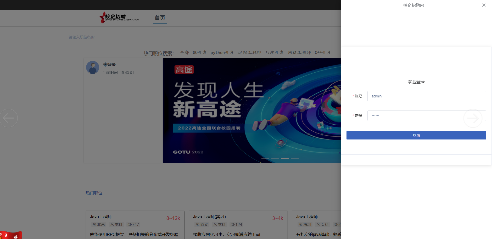
### 2.2 前台首页
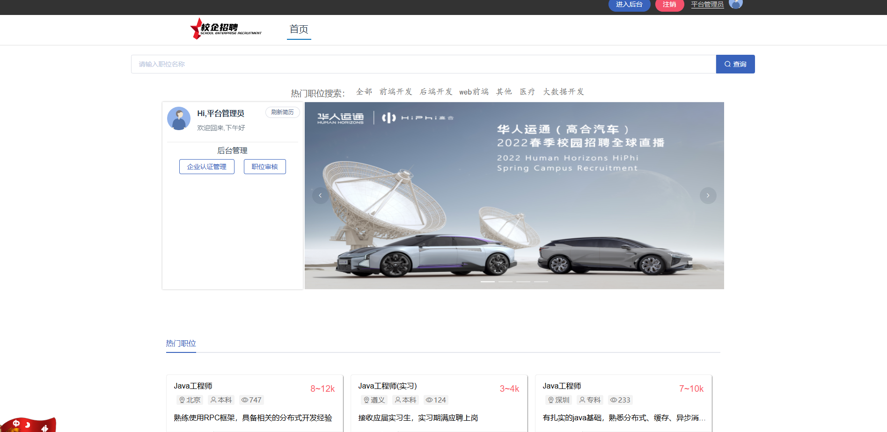
### 2.3 职位详情
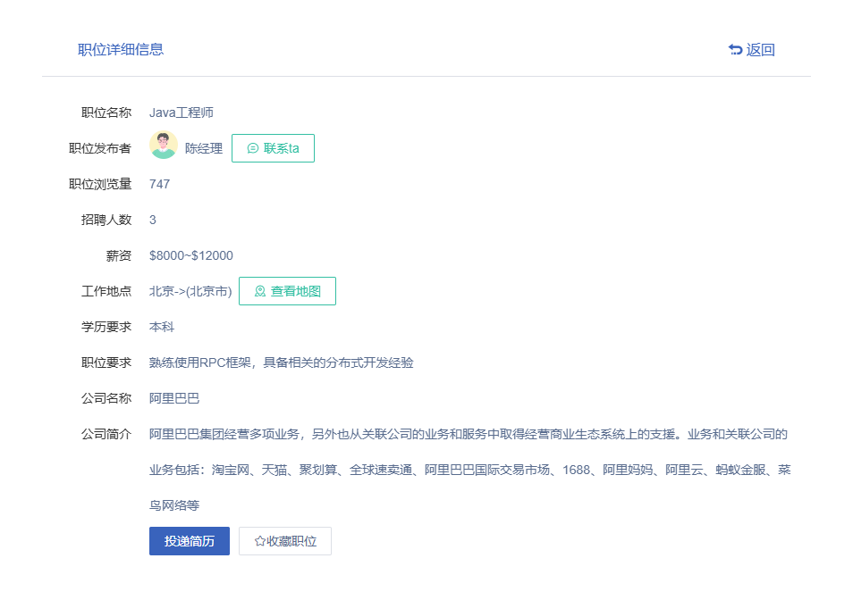
## 管理端
### 2.3 个人中心
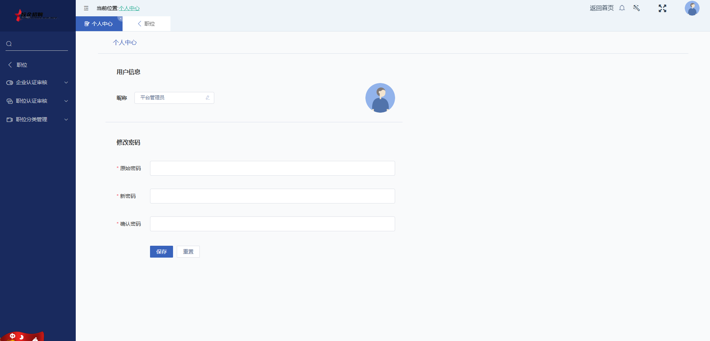
### 2.4 公司审核管理
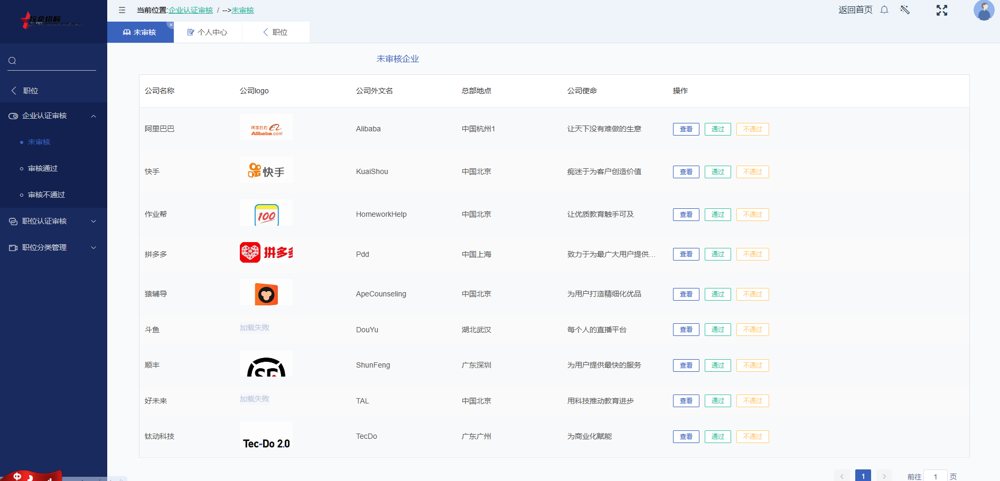
### 2.5 岗位审核管理
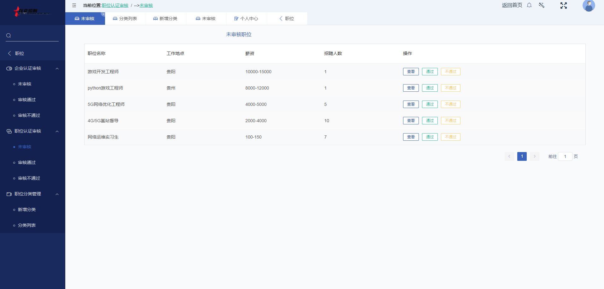
## 求职者
### 2.6 我的收藏
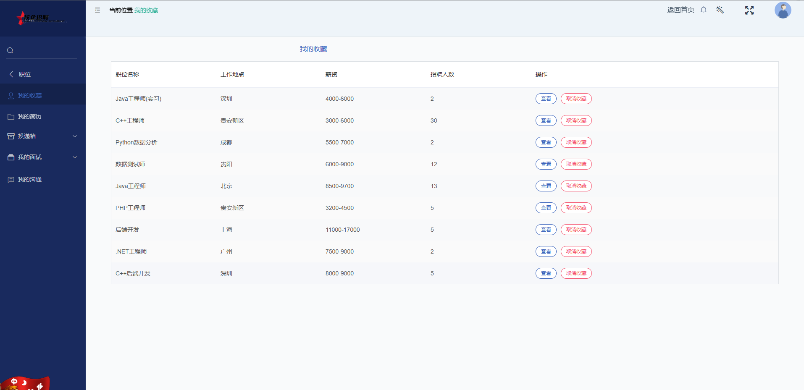
### 2.7 在线简历
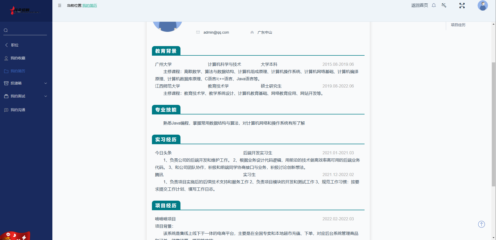
### 2.8 投递管理
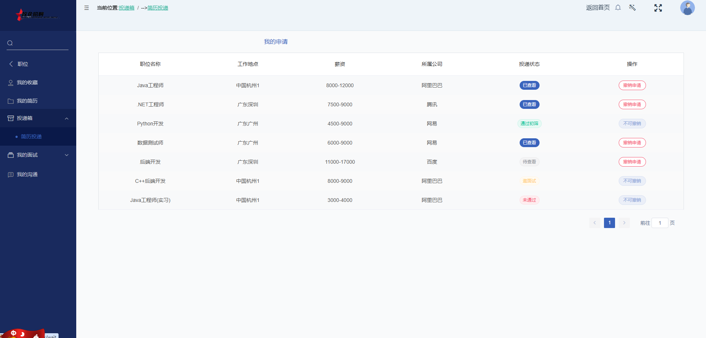
### 2.9 面试管理
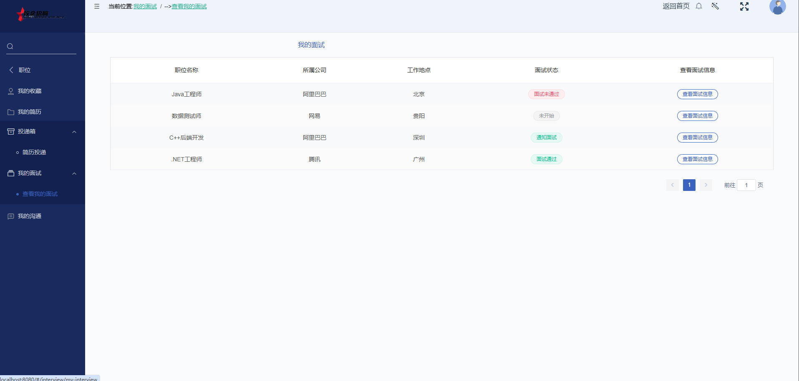
## 招聘者
### 2.10 职位管理
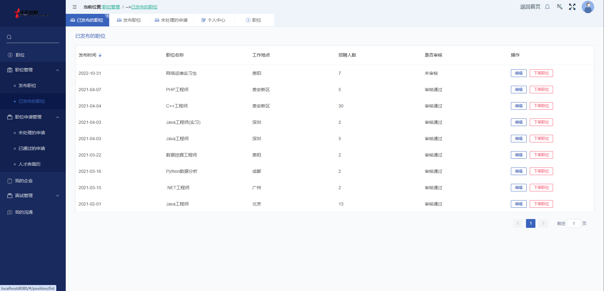
### 2.11 职位申请管理
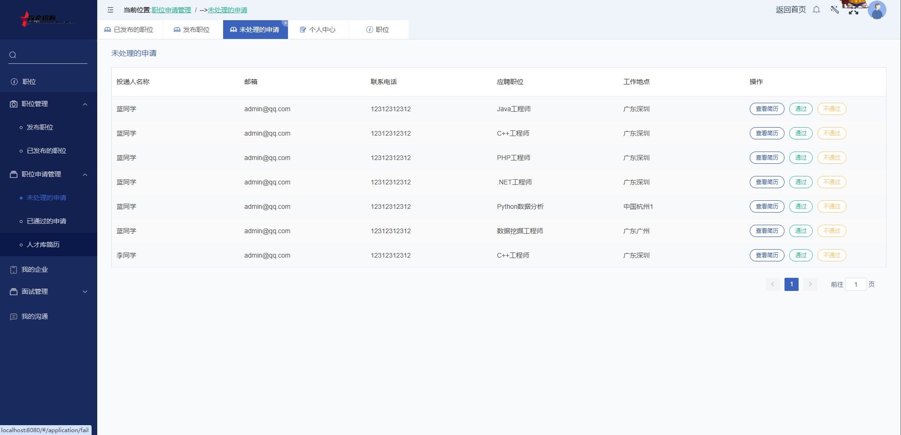
# 3 数据库设计
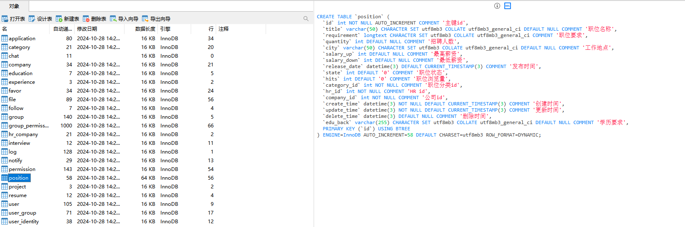
# 4 万字文档
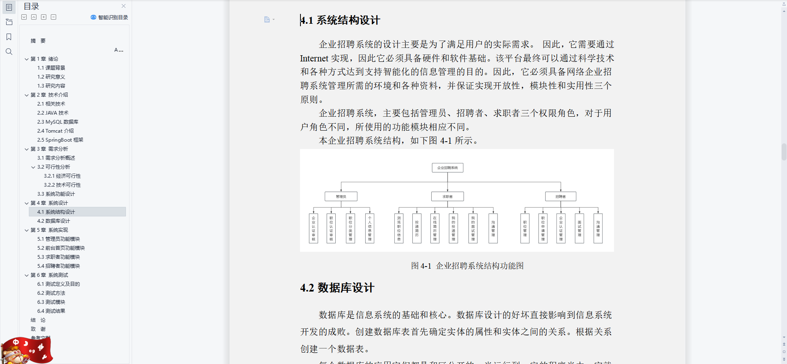
# 5 源码数据库获取(收费)

